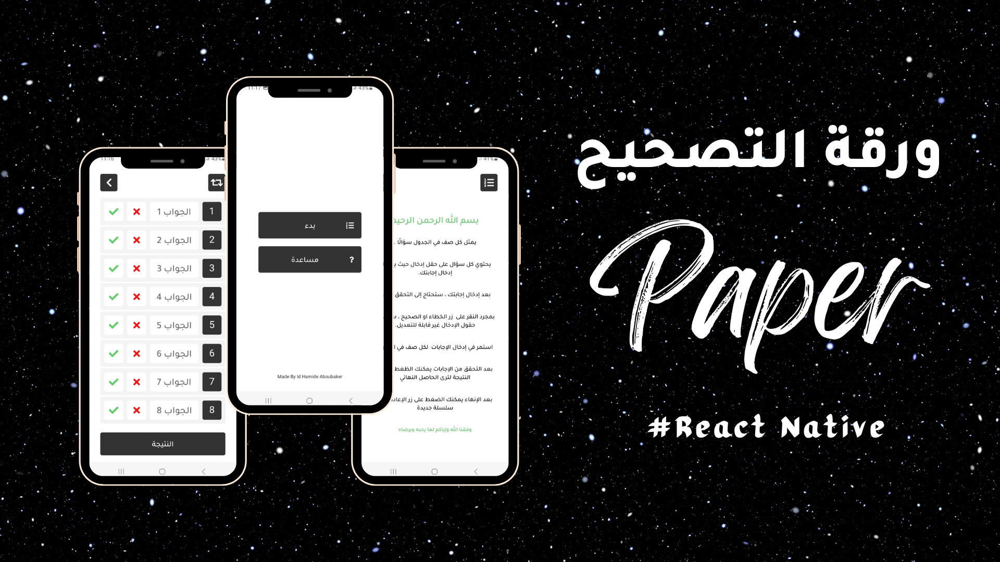

# Paper (Mobile App)
The Paper is a mobile application built using React Native, and React Navigation.
 It was my first React Native project, and it allowed me to learn how to use styles
 and navigate between components in the context of mobile development.
 The app was designed to replace the paper materials I had to bring to my driving school,
 providing a more convenient and efficient learning experience. Through this project,
 I gained valuable experience with new technologies and learned how to develop for mobile platforms.
 I'm excited to continue learning and growing as a junior developer,
 and I look forward to building more innovative and useful mobile applications in the future.

## Thumbnail

<a href="https://expo.dev/artifacts/eas/tBktHnEKUo8nh511GrZbcX.apk">Download</a>
